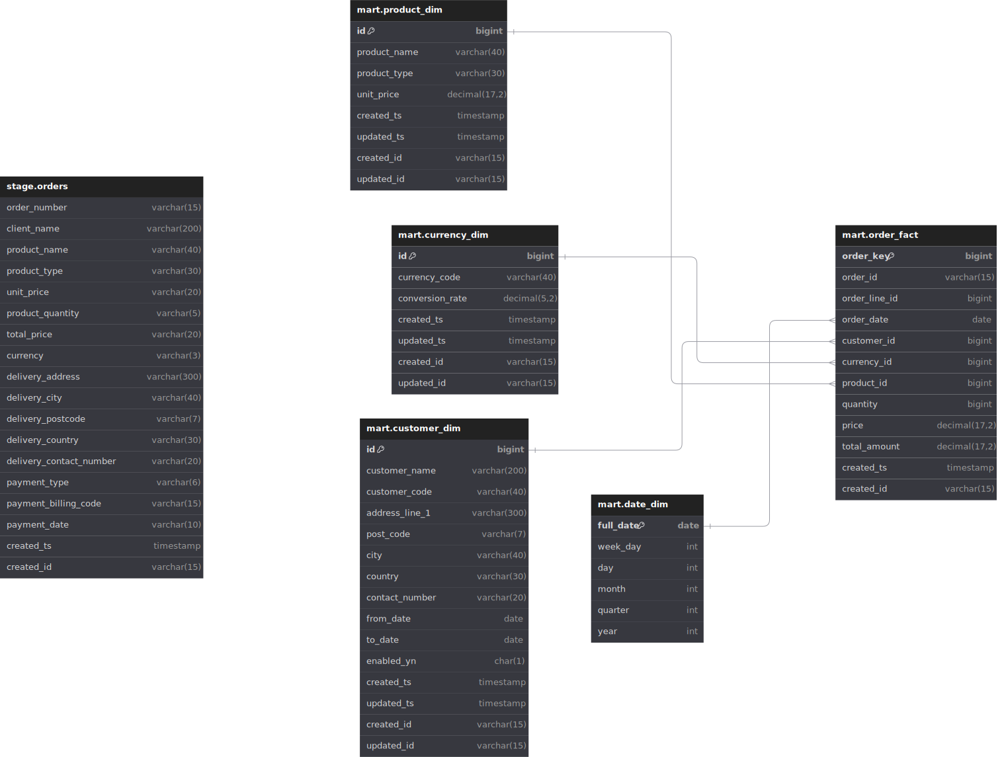

# Order-Analytics

`order-analytics` is a data engineering project for ABC Musical Instruments LTD, UK. The project caters to the order data analytics requirements using python and sqlite.

## Table of Contents

- [Pre-requisites](#pre-requisites)
- [Project deliverables](#project-deliverables)
- [Makefile utilities](#makefile-utilities)
- [How to run locally?](#how-to-run-locally)
- [Other useful commands](#other-useful-commands)
- [Author](#author)

## Pre-requisites
- Python 3.9
- Make utility. Please check [Make ](https://gnuwin32.sourceforge.net/packages/make.htm) for installation in windows.

## Project deliverables

- Datamodel
- ETL Specification Document
- Python ETL Code
- Documentation

### Data model diagrams

## Makefile utilities

This project comes with a `Makefile` that contains a number of useful utility.

```bash 
❯ make
Usage: make <target>

Targets:
install           ## Virtual environment setup
test              ## Run tests and generate coverage report.
run               ## Run the project.
clean             ## Clean unused files.

fmt               ## Format code using black & isort.
lint              ## Run pep8, black, mypy linters.
build             ## Build package.
docs              ## Build the documentation.
```

## How to run locally?

Below find the step by step instructions to run the code locally

### Clone the repository
```bash
git clone https://github.com/sibyabin/order-analytics.git
cd order-analytics
```
### Setting up your own virtual environment

Run `make install` to create a virtual environment `venv` locally and then install all the package requirements to it.

```bash
$ make setup
Going to setup environment
python -m venv venv && . venv/Scripts/activate && venv/Scripts/python -m pip install --upgrade pip setuptools
Collecting pip
  Using cached pip-24.0-py3-none-any.whl (2.1 MB)
Collecting setuptools
  Using cached setuptools-70.0.0-py3-none-any.whl (863 kB)
Installing collected packages: pip, setuptools
  Attempting uninstall: pip
    Found existing installation: pip 20.2.3
    Uninstalling pip-20.2.3:
      Successfully uninstalled pip-20.2.3
  Attempting uninstall: setuptools
    Found existing installation: setuptools 49.2.1
    Uninstalling setuptools-49.2.1:
      Successfully uninstalled setuptools-49.2.1
Successfully installed pip-24.0 setuptools-70.0.0
venv/Scripts/pip3 install -r requirements-test.txt
Collecting pytest (from -r requirements-test.txt (line 1))
  Downloading pytest-8.2.2-py3-none-any.whl.metadata (7.6 kB)

.........................................................
.........................................................

Using cached idna-3.7-py3-none-any.whl (66 kB)
Using cached urllib3-2.2.1-py3-none-any.whl (121 kB)
Installing collected packages: urllib3, idna, charset-normalizer, certifi, requests, order-analytics
  Running setup.py develop for order-analytics
Successfully installed certifi-2024.6.2 charset-normalizer-3.3.2 idna-3.7 order-analytics-0.1.0 requests-2.32.3 urllib3-2.2.1
Setup completed
```

### Run the tests to ensure everything is working locally

Run `make test` to run the tests.

### Run the code

Run `make run` to run the code. This will
- create databases and tables(if not exists)
- load data to staging
- load data from staging to mart tables
- store exception records to exception schema tables

### Cleaning the project

`make clean` will remove 

- logs
- site directory
- build packages
- virtual environment etc.

## Other useful commands

| Command | Description |
| ------ | ------ |
| `make fmt` | To format the code |
| `make lint` | To run the linter |
| `make docs` | To build the docs.|

## Project Links

- [Issues](https://github.com/sibyabin/order-analytics/issues)

- [Project Board](https://github.com/users/sibyabin/projects/3/views/1?layout=board)

## Author

- [Siby Abin Thomas](https://www.github.com/sibyabin)